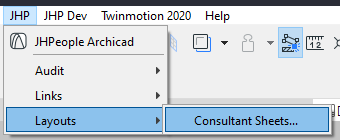
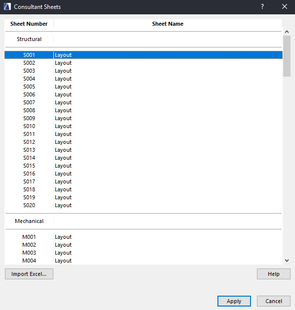
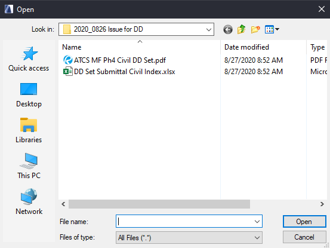
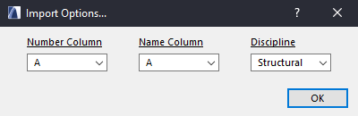
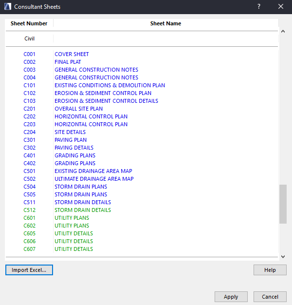

##### [< Back to index](index.md)

## JHP Layouts Plugin
#### Archicad 23
-----
The **JHP Layouts** plugin currently adds a single tool to the _JHP_ > _Layouts_ submenu.
- **Consultant Sheets...** - Provides a dialog for importing and creating/renaming consultant sheet layouts.

Choosing this menu option opens the **Consultant Sheets Dialog**.

### **Before attempting to use this tool ensure all consultant sheets are reserved!**

The **Help** button directs to this page.

The main element of the dialog is a preview of the layouts as they are and what changes will be made when you click **Apply**.

The **Cancel** button will close the dialog without making any changes to sheets.

The list box shows each discipline with a header and can be scrolled through.

Modifying the layouts is achieved by clicking **Import Excel...** which will allow choosing a valid .xlsx document.

After choosing a valid Excel document, the **Import Options...** dialog will open allowing specification of which columns to read for sheet numbers and names as well as the discipline to write these values to.

The **Number Column** dropdown corresponds to the column in excel that contains the *Sheet Numbers*.
The **Name Column** dropdown corresponds to the column in excel that contain the *Sheet Names*.
The **Discipline** dropdown allows choosing which discipline folder the sheets will be created/renamed in.

Upon clicking **OK**, the **Consultants Sheet Dialog** will be redrawn with a preview of the new sheet numbers and names for the specified discipline, for review before applying.

Review these changes before clicking **Apply** and ensure the values were read correctly. If not, you may reimport the excel file and choose different columns or discipline before applying, and the preview will be overwritten with the new choices.

The colors of the sheet names show which sheets will be *renamed* (existing sheets, blue) and which will be *created* (new sheets, green).

Once satisfied with the imported sheet names, click **Apply** to execute the renaming/sheet creation. 

